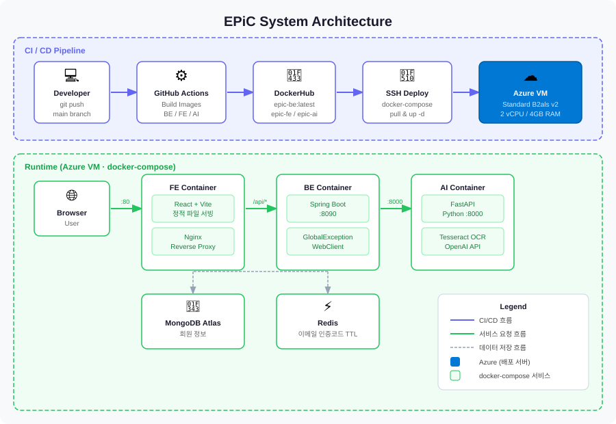

# 🎓 EPiC: Edu Path in CS

```
경희대학교 소프트웨어융합대학 학생들의 효율적인 학업 계획을 지원하기 위한 서비스입니다.
```


#### 🔼 제1회 세모톤 최우수상 수상 🔼

<br>

## 💡 Key Features


- 소프트웨어융합대학 <b><code>3개 학과</code></b>의 교과목 정보, 학번별 졸업 요건 등의 정보를 <b><code>AI 모델</code></b>이 학습하도록 함
- 학교 생활에 필요한 정보를 <b>손쉽게</b> 확인하고, <b>효율적으로</b> 학업 계획 수립을 위한 기능들을 제공함

> <h3>✅ 졸업 요건 확인</h3>
- <b><code>학과</code></b>와 <b><code>학번</code></b>을 선택하고, 경희대학교 포털에서 제공하는 <b><code>졸업진단표 PDF 파일</code></b>을 업로드
- <b><code>졸업 요건</code></b> 충족을 위해 추가로 필요한 사항들에 대해 안내
- (현재) 컴퓨터공학과, 인공지능학과, 소프트웨어융합학과의 `2019학번` ~ `2025학번` 대상

> <h3>✅ 커리큘럼 추천</h3>
- <b><code>관심 키워드</code></b>를 선택하거나 직접 입력
- <b><code>AI 모델</code></b>이 학습한 정보를 바탕으로 <b><code>교과목 추천</code></b>
- 관심 키워드와 관련된 <b><code>추가 질문</code></b> 가능

> <h3>✅ 시간표 비교</h3>
- <b><code>시간표 이미지</code></b>를 업로드
- 공통적으로 <b><code>수업이 없는 시간대</code></b>를 표시

<br>

## 🎨 Design

UI/UX 디자인은 Figma로 작업되었습니다.

👉 [Figma 디자인 보기](https://www.figma.com/design/onpqT8lZaHGU02H0o5rusR/semothon-team15?node-id=16-32&t=esO1IyiRnIBB927e-0)

<br>

## 👥 Team Members

| Name   | Department    | Role   | GitHub |
|--------|---------------|--------|--------|
| 김민   | 컴퓨터공학과  | BE/FE  | [kmin1231](https://github.com/kmin1231) |
| 김수진 | 의류디자인학과 | Design | - |
| 송동현 | 인공지능학과  | AI     | [d0ng-h](https://github.com/d0ng-h) |
| 송승윤 | 컴퓨터공학과  | BE/FE  | [SongSeungYun](https://github.com/SongSeungYun) |
| 신예준 | 컴퓨터공학과  | BE     | [dodobirds999](https://github.com/dodobirds999) |
| 정윤서 | 컴퓨터공학과  | AI     | [jys0615](https://github.com/jys0615) |

<br>

## 📦 Original Repositories

| Service | Repository |
|---------|------------|
| Frontend | [2025_TEAM_15_FE](https://github.com/semothon/2025_TEAM_15_FE) |
| Backend | [2025_TEAM_15_BE](https://github.com/semothon/2025_TEAM_15_BE) |
| AI | [2025_TEAM_15_AI](https://github.com/semothon/2025_TEAM_15_AI) |

<br>

## 🧩 Project Architecture



<br>

## 🔧 Tech Stack

**Backend**


**Frontend**


**DevOps**


<br>

## ▶️ How to Run

```bash
git clone https://github.com/jys0615/EPiC.git
cd EPiC
```

**Docker로 전체 실행 (권장)**
```bash
docker-compose up --build
```

**개별 실행**

Backend
```bash
cd be
./gradlew build
./gradlew bootRun
```

Frontend
```bash
cd fe
npm install
npm run dev
```

AI
```bash
cd ai
pip install -r requirements.txt
uvicorn main:app --reload
```

<br>

## 🛠️ Troubleshooting

개발 및 배포 과정에서 발생한 주요 이슈와 해결 방법을 정리하였습니다.

<a href="./docs/TROUBLESHOOTING.md" target="_blank">👉 트러블슈팅 보기</a>

<br>

## 🔓 License

This project is licensed under the MIT License. See the [LICENSE](./LICENSE) file for details.
