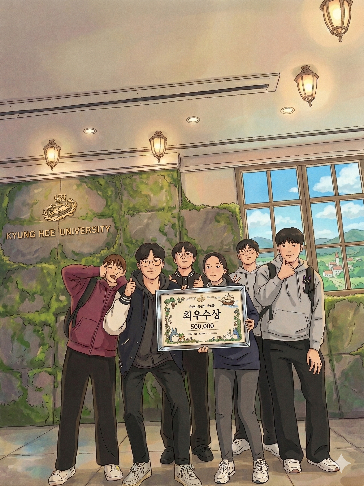

<div align="center">

# 🎓 EPiC: Edu Path in CS

**소프트웨어융합대학 학생들의 효율적인 학업 계획을 지원하는 AI 기반 서비스**


<br>

🥈 **경희대학교 제1회 세모톤 최우수상 수상**

<br>


</div>

---

## 📌 소개

소프트웨어융합대학 **3개 학과**의 교과목 정보와 졸업 요건을 AI 모델이 학습하여, 학교 생활에 필요한 정보를 손쉽고 효율적으로 제공합니다.

<br>

## ✨ Key Features


<br>

<table>
  <tr>
    <td align="center" width="33%">
      <h3>🎓 졸업 요건 확인</h3>
      <p>학과와 학번을 선택하고<br><b>졸업진단표 PDF</b>를 업로드하면<br>졸업 요건 충족 현황을 분석</p>
      <sub>컴퓨터공학과 · 인공지능학과 · 소프트웨어융합학과<br>2019 ~ 2025학번 지원</sub>
    </td>
    <td align="center" width="33%">
      <h3>📚 커리큘럼 추천</h3>
      <p>관심 키워드를 입력하면<br><b>AI 모델</b>이 학습한 정보를 바탕으로<br>맞춤 교과목을 추천</p>
      <sub>추가 질문을 통한 심화 추천 지원</sub>
    </td>
    <td align="center" width="33%">
      <h3>🗓️ 시간표 비교</h3>
      <p>두 명 이상의 시간표 이미지를<br>업로드하면 공통으로<br><b>비어있는 시간대</b>를 분석</p>
      <sub>여러 장 동시 업로드 지원</sub>
    </td>
  </tr>
</table>

<br>

## 🎨 Design

UI/UX 디자인은 Figma로 작업되었습니다.

👉 [Figma 디자인 보기](https://www.figma.com/design/onpqT8lZaHGU02H0o5rusR/semothon-team15?node-id=16-32&t=esO1IyiRnIBB927e-0)

<br>

## 👥 Team Members

<table>
  <tr>
    <th>이름</th>
    <th>학과</th>
    <th>역할</th>
    <th>GitHub</th>
  </tr>
  <tr>
    <td>김민</td>
    <td>컴퓨터공학과</td>
    <td><code>BE</code> <code>FE</code></td>
    <td><a href="https://github.com/kmin1231">@kmin1231</a></td>
  </tr>
  <tr>
    <td>김수진</td>
    <td>의류디자인학과</td>
    <td><code>Design</code></td>
    <td>-</td>
  </tr>
  <tr>
    <td>송동현</td>
    <td>인공지능학과</td>
    <td><code>AI</code></td>
    <td><a href="https://github.com/d0ng-h">@d0ng-h</a></td>
  </tr>
  <tr>
    <td>송승윤</td>
    <td>컴퓨터공학과</td>
    <td><code>BE</code> <code>FE</code></td>
    <td><a href="https://github.com/SongSeungYun">@SongSeungYun</a></td>
  </tr>
  <tr>
    <td>신예준</td>
    <td>컴퓨터공학과</td>
    <td><code>BE</code></td>
    <td><a href="https://github.com/dodobirds999">@dodobirds999</a></td>
  </tr>
  <tr>
    <td>정윤서</td>
    <td>컴퓨터공학과</td>
    <td><code>AI</code></td>
    <td><a href="https://github.com/jys0615">@jys0615</a></td>
  </tr>
</table>

<br>

## 📦 Original Repositories

> 세모톤 당시 사용한 원본 리포지토리입니다.

| Service | Repository |
|:-------:|:----------:|
| 🖥️ Frontend | [2025_TEAM_15_FE](https://github.com/semothon/2025_TEAM_15_FE) |
| ⚙️ Backend | [2025_TEAM_15_BE](https://github.com/semothon/2025_TEAM_15_BE) |
| 🤖 AI | [2025_TEAM_15_AI](https://github.com/semothon/2025_TEAM_15_AI) |

<br>

## 🧩 Project Architecture


<br>

## 🔧 Tech Stack

<div align="center">

**Backend**


**Frontend**


**DevOps**


</div>

<br>

## ▶️ How to Run

**1. 저장소 클론**

```bash
git clone https://github.com/jys0615/EPiC.git
cd EPiC
```

**2. 환경변수 설정**

```bash
cp .env.example .env
# .env 파일에 필요한 값 입력
```

**3. Docker로 전체 실행 (권장)**

```bash
docker-compose up --build
```

<details>
<summary>개별 실행 방법 보기</summary>

<br>

**Backend**
```bash
cd be
./gradlew build
./gradlew bootRun
```

**Frontend**
```bash
cd fe
npm install
npm run dev
```

**AI**
```bash
cd ai
pip install -r requirements.txt
uvicorn main:app --reload
```

</details>

<br>

## 📊 Performance Baseline

리팩토링 전 실배포 환경(Azure)에서 측정한 API 응답 시간 및 네트워크 현황입니다.

<a href="./docs/PERFORMANCE_BASELINE.md" target="_blank">👉 베이스라인 측정 결과 보기</a>

<br>

## 🔨 Refactoring Plan

성능·보안·품질 향상을 위한 리팩토링 계획을 정리하였습니다.

<a href="./docs/REFACTORING_PLAN.md" target="_blank">👉 리팩토링 계획 보기</a>

<br>

## 🛠️ Troubleshooting

개발 및 배포 과정에서 발생한 주요 이슈와 해결 방법을 정리하였습니다.

<a href="./docs/TROUBLESHOOTING.md" target="_blank">👉 트러블슈팅 보기</a>

<br>

## 🔓 License

This project is licensed under the MIT License. See the [LICENSE](./LICENSE) file for details.

---

<div align="center">

<br>

*경희대학교 제1회 세모톤 최우수상 🥈*



<br>

*함께해줘서 고마워요 💙*

<br>

</div>
